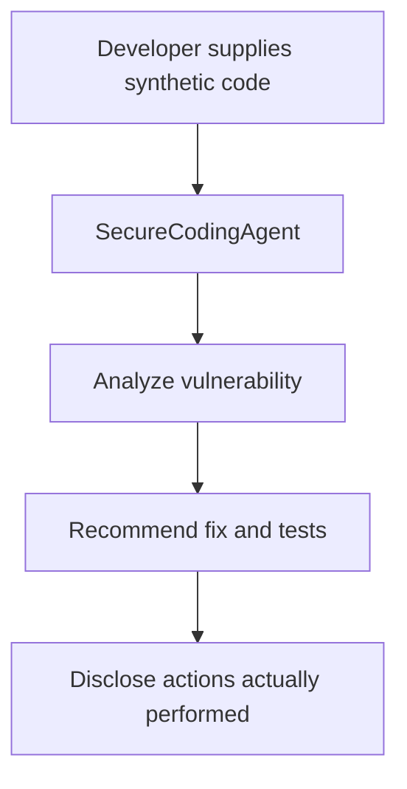
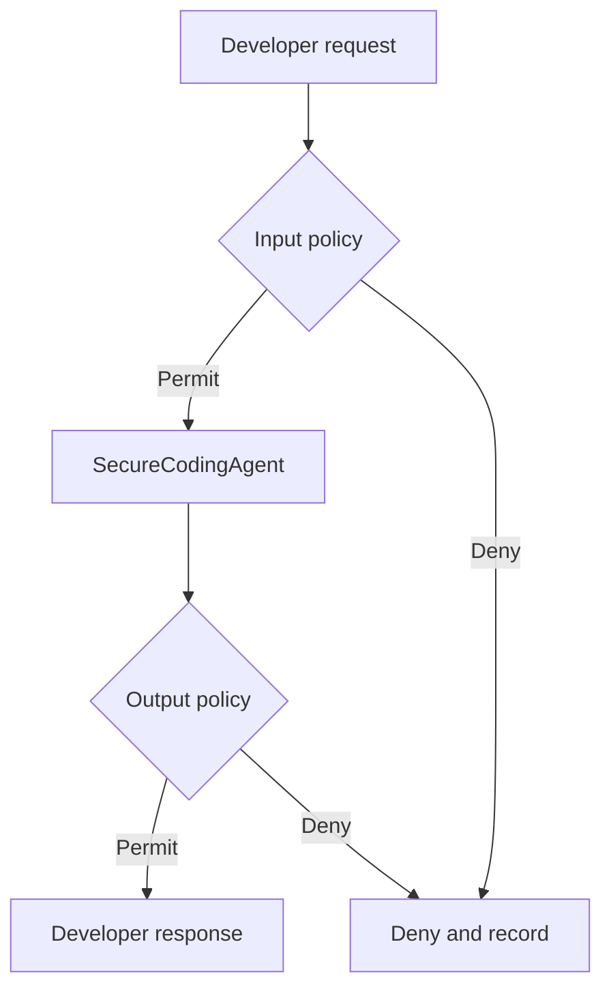

# Secure Agentic Developer Environment — Runtime Governance Lab

A dual-framework AI security lab demonstrating how to govern coding agents that can eventually read repositories, call development tools, execute commands, and interact with CI/CD systems. The same security boundaries are developed in Python with the OpenAI Agents SDK and in .NET with Microsoft Agent Framework.

> **Status:** Chapter 8 production-operations lab. Policies move through guarded development, staging, and production channels with persistent activation history, safe rollback, drift detection, boundary latency budgets, and readiness checks. The lab has no real repository, shell, Git, MCP, patch-writing, or deployment integrations. Do not deploy it to production.

## Business scenario

An enterprise is introducing AI-assisted coding platforms that can independently write, execute, and iterate on code. The security team must ensure that each agent has a verified identity, minimum necessary privileges, controlled tools, protected secrets, auditable actions, and human approval before sensitive changes or deployments.

`SecureCodingAgent` begins as a simple read-only application-security assistant. Later chapters add capabilities only after the appropriate governance control exists.

## Completed foundations

Establish a working ungoverned baseline before adding policy overhead:

- Equivalent Python and .NET agent wrappers
- One asynchronous `run` boundary per framework
- Immutable OWASP control metadata
- A risk-lookup exercise and tests
- A developer-agent threat model
- Explicit disclosure that recommendations are not executed actions
- Immutable principal, agent, tool, and execution-context models
- Configurable `PRE_INPUT`, `PRE_TOOL`, and `PRE_OUTPUT` attachments
- A noninvasive governed runner with visible `PERMIT` and `DENY` results
- Agent-to-policy identity binding that denies mismatched execution contexts
- Default-deny behavior when a required boundary has no evaluator
- Fail-closed evaluator timeouts and exceptions
- Immutable, semantically versioned policy rule sets
- Deterministic priority ordering and pre-attachment validation
- Local policy diagnostics for malicious and benign payloads
- Explicit policy promotion and rollback between `1.0.0` and `1.1.0`
- Risk-based execution-ring assignments for coding tools
- Rust FFI evaluation for deterministic in-memory operations
- Bounded restricted workers with scrubbed environments and hard timeouts
- Default denial for privileged Ring 3 operations pending human approval
- Attack tests for unknown tools, missing evaluators, oversized payloads, and secret inheritance
- Versioned OWASP control coverage matrix
- Evidence-backed verified, partial, missing, and external-required findings
- Policy-to-risk traceability annotations and placement validation
- SHA-256 fingerprint binding each report to its audited configuration
- CI-friendly exit behavior that exposes incomplete production coverage

## Baseline flow



Chapter 2 wraps this unchanged boundary:



Chapter 3 fills those boundaries with independently versioned rule sets while keeping the agent unchanged.

Chapter 4 routes each authorized concrete tool request through a risk-appropriate execution path. It does not let ring classification bypass Chapter 3 authorization.

Chapter 5 audits the real controls and tests. It does not mistake an empty checkpoint or a written annotation for proof of protection.

Chapter 6 governs authority moving between agents. Delegations are signed, short-lived, one-use, repository-bound, phase-bound, key-bound, and limited to one delegation hop. A valid handoff still requires local authorization by the receiver.

Chapter 7 records each policy verdict and proves through tests that the expected boundary fired. Local hash chaining improves lab integrity but does not make in-memory records production audit evidence.

Chapter 8 operates policies as versioned security software: validate, stage, promote,
monitor, detect drift, and roll back only the exact bad version. Critical boundaries
fail closed and unhealthy enforcement components fail readiness.

## Repository layout

```text
python/                            OpenAI Agents SDK baseline and tests
python/governance/                 Identity, pipeline, policies, and runner
python/governed_agent_demo.py      Visible permit/deny demonstration
python/policy_diagnostics.py       Fast local policy validation harness
python/ring_runtime_demo.py        Rust/worker/Ring 3 routing demonstration
python/benchmark_ring_paths.py     Local latency comparison
python/control_audit.py            Evidence-based OWASP gap report and CI command
python/audit_demo.py                Chapter 7 timeline and failure classification demo
python/operations_demo.py           Chapter 8 promotion, readiness, drift, rollback demo
hot_path_evaluator/                Rust native policy evaluator
dotnet/SecureCodingAgentBaseline/  Microsoft Agent Framework baseline
dotnet/SandboxWorker/              Restricted .NET mock worker
examples/soc-agent/                Archived Chapter 1A secondary example
docs/CHAPTER-2.md                  Chapter 2 design and demonstrations
docs/CHAPTER-3.md                  Chapter 3 policy design and diagnostics
docs/CHAPTER-4.md                  Corrected rings, FFI, worker, and attack guide
docs/CHAPTER-5.md                  Coverage evidence, findings, and audit guide
docs/CHAPTER-6.md                  Signed cross-agent delegation and mesh guide
docs/CHAPTER-7.md                  Audit schema, evidence tests, and production limits
docs/CHAPTER-8.md                  Deployment, SLO, promotion, rollback, drift, health
docs/OWASP-GAP-REPORT.md           Employer-readable current coverage summary
docs/THREAT-MODEL.md               Assets, actors, boundaries, abuse cases
docs/ROADMAP.md                    Planned governance increments
```

## macOS prerequisites

Install Visual Studio Code, Python 3.11+, .NET 8 SDK, Rust, and Git. Install the Python, Pylance, C# Dev Kit, and rust-analyzer VS Code extensions.

Verify:

```bash
python3 --version
dotnet --version
git --version
rustc --version
cargo --version
```

## Run Python

```bash
python3 -m venv .venv
source .venv/bin/activate
python -m pip install --upgrade pip
pip install -r requirements.txt
export OPENAI_API_KEY="your-key-here"
python python/secure_coding_agent.py
python python/governed_agent_demo.py
python python/policy_diagnostics.py 1.1.0
python python/policy_diagnostics.py 1.0.0
```

Run the Chapter 1 mapping and tests:

```bash
python python/risk_lookup.py
PYTHONPATH=python pytest python -v
```

Build Rust and run the Chapter 4 paths from the repository root:

```bash
cargo test --manifest-path hot_path_evaluator/Cargo.toml
cargo build --release --manifest-path hot_path_evaluator/Cargo.toml
python python/ring_runtime_demo.py
python python/benchmark_ring_paths.py
```

Run the Chapter 5 audit:

```bash
python python/control_audit.py
python python/control_audit.py --fail-on-partial
PYTHONPATH=python python -m pytest python/test_audit.py -v
PYTHONPATH=python python python/audit_demo.py
PYTHONPATH=python pytest python/test_operations.py -v
PYTHONPATH=python python python/operations_demo.py
```

The second command intentionally returns exit code `2` while production-relevant coverage remains partial.

Expected mapping output:

```text
agentmesh-runtime
True
```

## Run .NET

```bash
dotnet restore dotnet/SecureCodingAgentBaseline/SecureCodingAgentBaseline.csproj
dotnet build dotnet/SandboxWorker/SandboxWorker.csproj
dotnet build dotnet/SecureCodingAgentBaseline/SecureCodingAgentBaseline.csproj
export OPENAI_API_KEY="your-key-here"
dotnet run --project dotnet/SecureCodingAgentBaseline/SecureCodingAgentBaseline.csproj
```

Microsoft Agent Framework packages evolve quickly. Validate the provider version before production use.

## What this baseline does not do

| Capability | Current state |
|---|---|
| Analyze code supplied in the prompt | Available |
| Recommend fixes and tests | Available |
| Read files from the laptop | Not available |
| Change source code | Not available |
| Execute shell commands | Not available |
| Install dependencies | Not available |
| Commit or push code | Not available |
| Deploy an application | Not available |
| Enforce permit/deny policies | Available at three boundaries |
| Invoke real development tools | Not available; Chapter 4 uses safe simulations |
| Route mock tools by execution risk | Available |

## Security design decisions

- Secrets are loaded through environment variables and excluded from Git.
- The agents have no real action-taking tools through Chapter 8.
- Source code and repository instructions are treated as untrusted content.
- The agent must not claim that recommendations were executed.
- The OWASP map is threat-model metadata, not a functioning security control.
- Python and .NET expose matching interception boundaries for Chapter 2.
- The original SOC baseline remains available as a secondary use case.
- Principal authority and tool capability are independently evaluated.
- A context cannot gain claims or tools by mutation during a request.
- Tool authorization runs only when a concrete tool invocation is requested.
- Pattern checks are documented as educational controls, not production detection.
- Policy versions are explicit and unknown versions fail before agent execution.
- Tool allow rules are layered with principal, inventory, and scope authorization.
- Ring routing occurs only after PRE_TOOL authorization succeeds.
- Ring 0 is limited to in-memory operations; read-only alone is not enough.
- The worker is accurately documented as process isolation, not a complete OS sandbox.
- Ring 3 remains denied until human approval is implemented.
- Audit coverage requires correct-layer implementation and passing-test evidence.
- Partial findings remain partial; checkpoint presence cannot promote them.
- Every audit includes the matrix version and configuration fingerprint.
- Audit metadata is deeply immutable and excludes raw prompts and secrets.
- `ALLOW`, `DENY`, and `ERROR` remain separate operational meanings.
- Correlation IDs link evidence but do not authenticate it.
- A local hash chain detects modification but is not signed or tamper-proof storage.
- T8 remains partial until audit evidence is durable and independently protected.
- Policies must move development → staging → production; direct promotion is rejected.
- Critical input and tool checks cannot be configured to fail open.
- Rollback verifies the currently active bad version and deduplicates incident triggers.
- Readiness fails when required governance state is unavailable.
- Chapter 8 is an operations-pattern lab, not a production control plane.

## OWASP examples

See [`docs/THREAT-MODEL.md`](docs/THREAT-MODEL.md) for coding-agent examples covering memory poisoning, tool misuse, privilege compromise, resource overload, cascading hallucinations, goal manipulation, deceptive behavior, untraceability, identity spoofing, and human-approval overload.

## Portfolio talking points

- Built equivalent agent-security boundaries across Python and .NET.
- Modeled coding-agent risks across runtime, identity, data, framework, and human-process layers.
- Established a safe, read-only baseline before granting tools or execution privileges.
- Separated documented control ownership from real runtime enforcement.
- Designed the project for measurable policy latency and repeatable attack testing.
- Demonstrated policy-as-code versioning, validation, promotion, and rollback.
- Built a cross-language Rust FFI enforcement path and bounded worker model.
- Corrected unsafe sandbox assumptions and prevented double tool execution.
- Built an evidence-based OWASP gap analyzer that exposes false confidence.
- Instrumented every policy evaluator with identity-, version-, and rule-aware evidence.
- Built security tests that prove the control fired and prohibited side effects never ran.
- Reconstructed cross-boundary failure timelines by correlation ID.
- Implemented guarded policy promotion, stale-safe rollback, drift checks, SLOs, and readiness.
- Separated runtime coverage from data, framework, identity, infrastructure, and human-process ownership.
- Preserved the original SOC use case to demonstrate reusable governance architecture.

## Safe Git workflow

Never commit `.env` or API keys. Before every commit:

```bash
git status
git diff --cached
```

Commit each chapter separately so reviewers can see the project evolve:

```bash
git add .
git commit -m "Add evidence-based OWASP gap analysis"
git push origin main
```

## Disclaimer

This is an educational security lab using synthetic code and identities. It is not affiliated with or endorsed by Microsoft, OpenAI, OWASP or any other employer or client.
