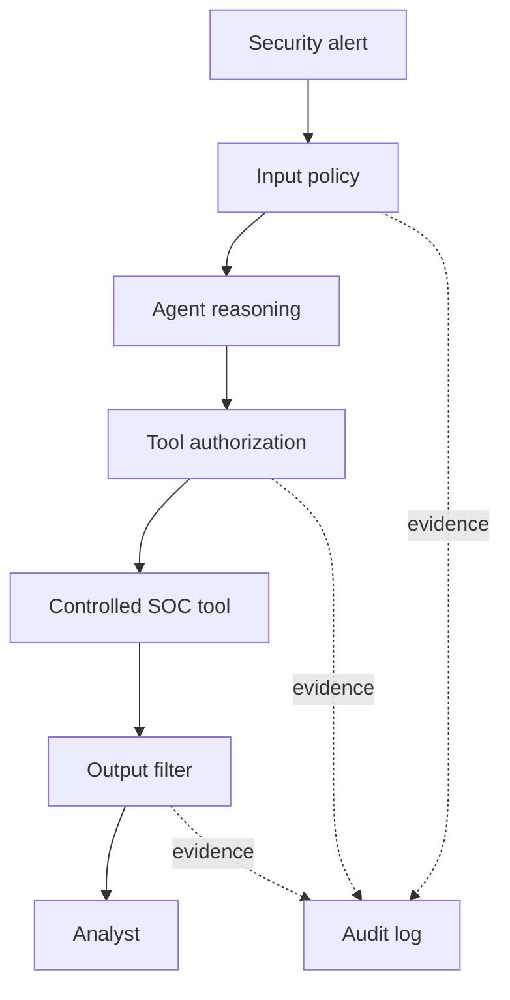

# Security Incident Agent — Runtime Governance Lab

A dual-framework AI security lab that demonstrates how runtime governance controls protect an autonomous Security Operations Center agent. The same domain is implemented with the OpenAI Agents SDK in Python and Microsoft Agent Framework in .NET.

> **Status:** Chapter 1 baseline. This version is intentionally read-only and ungoverned so future controls can be measured against a working baseline. Do not deploy it to production.

## Scenario

The `SecurityIncidentAgent` receives a suspicious-login alert involving a finance employee. It explains the risk and recommends safe investigation steps. Later iterations will add controlled SOC tools, runtime policies, identity, privilege limits, audit evidence, output filtering, and human approval.

## Why this project matters

Static analysis can find unsafe code, and an API gateway can protect network boundaries. Neither can fully decide whether a live agent is semantically justified in disabling a specific employee account. This lab places governance checkpoints inside the agent loop.

## Architecture



Chapter 1 implements the agent reasoning boundary and threat-model metadata. Dashed and policy-controlled stages are added in later chapters.

## Repository layout

```text
python/                         OpenAI Agents SDK baseline and tests
dotnet/SecurityAgentBaseline/   Microsoft Agent Framework baseline
docs/THREAT-MODEL.md            Assets, trust boundaries, and abuse cases
docs/ROADMAP.md                 Planned governance increments
```

## macOS prerequisites

Install:

- Visual Studio Code
- Python 3.11 or newer
- .NET 8 SDK
- Git
- VS Code extensions: Python, Pylance, and C# Dev Kit

Verify in the VS Code terminal:

```bash
python3 --version
dotnet --version
git --version
```

## Run the Python baseline

From the repository root:

```bash
python3 -m venv .venv
source .venv/bin/activate
python -m pip install --upgrade pip
pip install -r requirements.txt
export OPENAI_API_KEY="your-key-here"
python python/security_agent.py
```

Run the mapping activity and tests:

```bash
python python/risk_lookup.py
PYTHONPATH=python pytest python -v
```

Expected mapping output:

```text
agentmesh-runtime
True
```

## Run the .NET baseline

```bash
cd dotnet/SecurityAgentBaseline
dotnet restore
export OPENAI_API_KEY="your-key-here"
dotnet run
```

The Microsoft Agent Framework API evolves quickly. This project uses the current `Microsoft.Agents.AI.OpenAI` provider pattern; validate the package version before production use.

## Security decisions

- No secrets are stored in source control.
- The baseline has no action-taking tools.
- The OWASP map is immutable threat-model metadata, not enforcement.
- Non-runtime risks return `unmapped` rather than creating false confidence.
- Python and .NET expose matching `run` boundaries for later interception.

## Publish to GitHub

Never commit `.env` or an API key. From the repository root:

```bash
git init
git add .
git status
git commit -m "Build Chapter 1 security agent governance baseline"
git branch -M main
```

Create an empty public repository on GitHub named `ai-agent-runtime-governance-lab`. Do not add a README, license, or `.gitignore` on GitHub because they already exist locally. Then run:

```bash
git remote add origin https://github.com/YOUR-USERNAME/ai-agent-runtime-governance-lab.git
git push -u origin main
```

## Portfolio talking points

- Built equivalent agent boundaries across Python and .NET.
- Mapped agentic risks to runtime, identity, data, framework, and human-process layers.
- Separated threat-model metadata from real enforcement.
- Designed the baseline for measurable policy latency and security testing.
- Prevented the agent from falsely claiming that recommended containment actually occurred.

## Disclaimer

This is an educational security lab. All identities, alerts, and future tools use synthetic data. The project is not affiliated with or endorsed by Microsoft, OpenAI, or OWASP.

