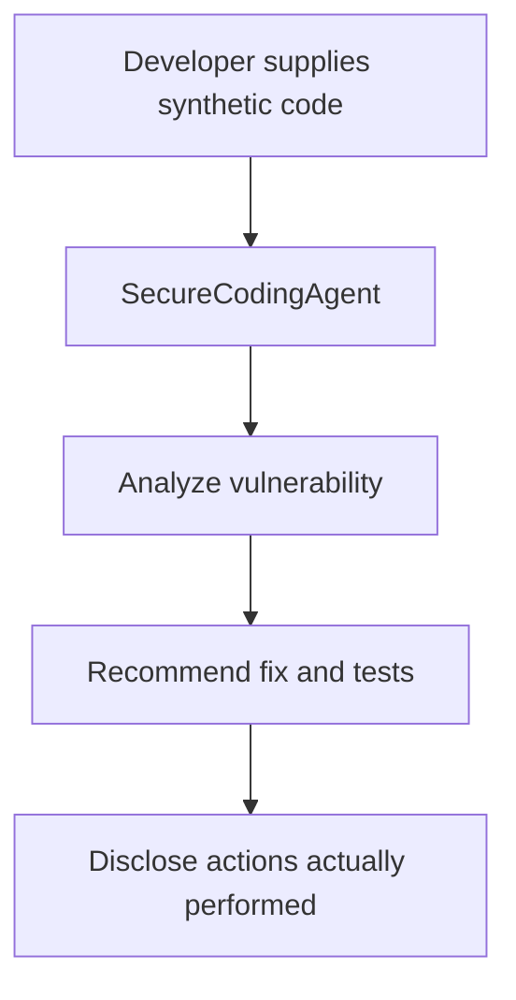
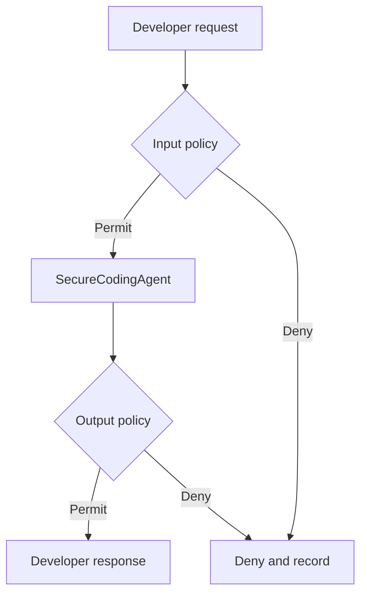

# Secure Agentic Developer Environment — Runtime Governance Lab

A dual-framework AI security lab demonstrating how to govern coding agents that can eventually read repositories, call development tools, execute commands, and interact with CI/CD systems. The same security boundaries are developed in Python with the OpenAI Agents SDK and in .NET with Microsoft Agent Framework.

> **Status:** Chapter 3 versioned-policy baseline. The agent performs read-only analysis of synthetic code behind immutable identity context and structured input, tool, and output rule sets. It has no real local-file, shell, Git, network, package, MCP, or deployment tools. Do not deploy this lab to production.

## Business scenario

An enterprise is introducing AI-assisted coding platforms that can independently write, execute, and iterate on code. The security team must ensure that each agent has a verified identity, minimum necessary privileges, controlled tools, protected secrets, auditable actions, and human approval before sensitive changes or deployments.

`SecureCodingAgent` begins as a simple read-only application-security assistant. Later chapters add capabilities only after the appropriate governance control exists.

## Completed foundations

Establish a working ungoverned baseline before adding policy overhead:

- Equivalent Python and .NET agent wrappers
- One asynchronous `run` boundary per framework
- Immutable OWASP control metadata
- A risk-lookup exercise and tests
- A developer-agent threat model
- Explicit disclosure that recommendations are not executed actions
- Immutable principal, agent, tool, and execution-context models
- Configurable `PRE_INPUT`, `PRE_TOOL`, and `PRE_OUTPUT` attachments
- A noninvasive governed runner with visible `PERMIT` and `DENY` results
- Agent-to-policy identity binding that denies mismatched execution contexts
- Default-deny behavior when a required boundary has no evaluator
- Fail-closed evaluator timeouts and exceptions
- Immutable, semantically versioned policy rule sets
- Deterministic priority ordering and pre-attachment validation
- Local policy diagnostics for malicious and benign payloads
- Explicit policy promotion and rollback between `1.0.0` and `1.1.0`

## Baseline flow



Chapter 2 wraps this unchanged boundary:



Chapter 3 fills those boundaries with independently versioned rule sets while keeping the agent unchanged.

## Repository layout

```text
python/                            OpenAI Agents SDK baseline and tests
python/governance/                 Identity, pipeline, policies, and runner
python/governed_agent_demo.py      Visible permit/deny demonstration
python/policy_diagnostics.py       Fast local policy validation harness
dotnet/SecureCodingAgentBaseline/  Microsoft Agent Framework baseline
examples/soc-agent/                Archived Chapter 1A secondary example
docs/CHAPTER-2.md                  Chapter 2 design and demonstrations
docs/CHAPTER-3.md                  Chapter 3 policy design and diagnostics
docs/THREAT-MODEL.md               Assets, actors, boundaries, abuse cases
docs/ROADMAP.md                    Planned governance increments
```

## macOS prerequisites

Install Visual Studio Code, Python 3.11+, .NET 8 SDK, and Git. Install the Python, Pylance, and C# Dev Kit VS Code extensions.

Verify:

```bash
python3 --version
dotnet --version
git --version
```

## Run Python

```bash
python3 -m venv .venv
source .venv/bin/activate
python -m pip install --upgrade pip
pip install -r requirements.txt
export OPENAI_API_KEY="your-key-here"
python python/secure_coding_agent.py
python python/governed_agent_demo.py
python python/policy_diagnostics.py 1.1.0
python python/policy_diagnostics.py 1.0.0
```

Run the Chapter 1 mapping and tests:

```bash
python python/risk_lookup.py
PYTHONPATH=python pytest python -v
```

Expected mapping output:

```text
agentmesh-runtime
True
```

## Run .NET

```bash
cd dotnet/SecureCodingAgentBaseline
dotnet restore
dotnet build
export OPENAI_API_KEY="your-key-here"
dotnet run
```

Microsoft Agent Framework packages evolve quickly. Validate the provider version before production use.

## What this baseline does not do

| Capability | Current state |
|---|---|
| Analyze code supplied in the prompt | Available |
| Recommend fixes and tests | Available |
| Read files from the laptop | Not available |
| Change source code | Not available |
| Execute shell commands | Not available |
| Install dependencies | Not available |
| Commit or push code | Not available |
| Deploy an application | Not available |
| Enforce permit/deny policies | Available at three boundaries |
| Invoke real development tools | Not available; planned for Chapter 4 |

## Security design decisions

- Secrets are loaded through environment variables and excluded from Git.
- The agent has no action-taking tools through Chapter 3.
- Source code and repository instructions are treated as untrusted content.
- The agent must not claim that recommendations were executed.
- The OWASP map is threat-model metadata, not a functioning security control.
- Python and .NET expose matching interception boundaries for Chapter 2.
- The original SOC baseline remains available as a secondary use case.
- Principal authority and tool capability are independently evaluated.
- A context cannot gain claims or tools by mutation during a request.
- Tool authorization runs only when a concrete tool invocation is requested.
- Pattern checks are documented as educational controls, not production detection.
- Policy versions are explicit and unknown versions fail before agent execution.
- Tool allow rules are layered with principal, inventory, and scope authorization.

## OWASP examples

See [`docs/THREAT-MODEL.md`](docs/THREAT-MODEL.md) for coding-agent examples covering memory poisoning, tool misuse, privilege compromise, resource overload, cascading hallucinations, goal manipulation, deceptive behavior, untraceability, identity spoofing, and human-approval overload.

## Portfolio talking points

- Built equivalent agent-security boundaries across Python and .NET.
- Modeled coding-agent risks across runtime, identity, data, framework, and human-process layers.
- Established a safe, read-only baseline before granting tools or execution privileges.
- Separated documented control ownership from real runtime enforcement.
- Designed the project for measurable policy latency and repeatable attack testing.
- Demonstrated policy-as-code versioning, validation, promotion, and rollback.
- Preserved the original SOC use case to demonstrate reusable governance architecture.

## Safe Git workflow

Never commit `.env` or API keys. Before every commit:

```bash
git status
git diff --cached
```

Commit each chapter separately so reviewers can see the project evolve:

```bash
git add .
git commit -m "Add versioned policies for agent boundaries"
git push origin main
```

## Disclaimer

This is an educational security lab using synthetic code and identities. It is not affiliated with or endorsed by Microsoft, OpenAI, OWASP or any other employer or client.
