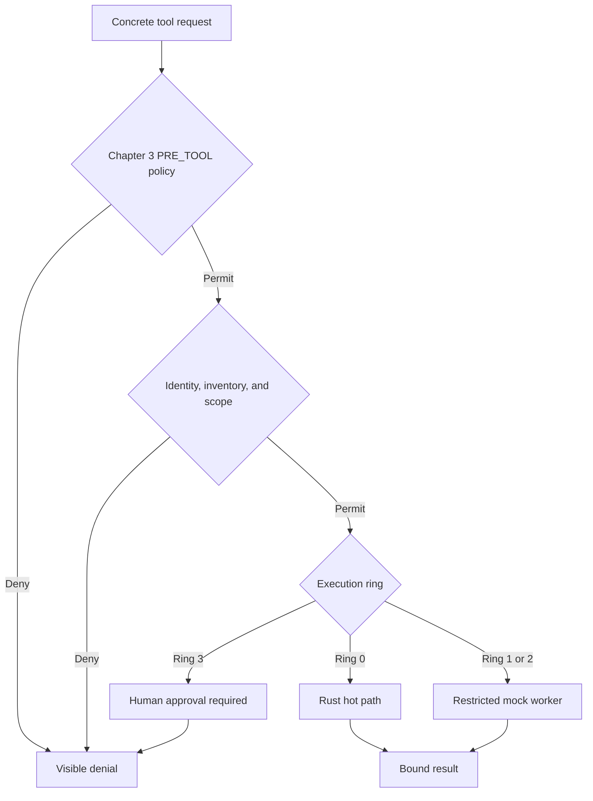

# Chapter 4 — Execution Rings, Rust FFI, and Restricted Workers

## The simple idea

Chapter 3 decides whether a tool is permitted. Chapter 4 decides **where that permitted tool may run**.

Think of a courthouse:

- Reading a public notice in the lobby is low risk.
- Reading a case file requires a controlled room.
- Running untrusted software or contacting an outside system needs stronger separation.
- Changing production is like opening the evidence vault: the lab refuses until human approval exists.

## The complete decision order



The order matters. Ring classification never replaces authorization. A fast Rust `ALLOW` cannot grant a tool that Chapter 3 or the principal identity denied.

## Corrected execution rings

The book classifies mainly by whether a tool reads, writes, or uses a network. That is incomplete. A read-only tool can still leak confidential client data, and a unit-test runner can execute malicious code. This lab also considers code execution, data sensitivity, and blast radius.

| Ring | Meaning in this lab | Examples | Route |
|---|---|---|---|
| 0 | In-memory, deterministic, no filesystem/network/side effect | `prompt-code-reader` | Rust FFI |
| 1 | Local sensitive operation, restricted and simulated | `repository-reader`, `sast-scanner` | Worker process |
| 2 | Untrusted code or external boundary | `unit-test-runner`, `dependency-advisory-lookup` | Worker process with no real code/network |
| 3 | Privileged or irreversible action | shell, Git push, production deployment | Deny pending human approval |

Unknown tools have no ring and fail closed.

## What Rust does

`hot_path_evaluator` compiles as a native shared library:

- macOS: `libhot_path_evaluator.dylib`
- Linux: `libhot_path_evaluator.so`
- Windows: `hot_path_evaluator.dll`

Python calls it with `ctypes`; .NET calls it through `NativeLibrary` and marshaling. The interface passes only a tool name, integer ring, and principal ID. It performs exact-name matching and returns:

| Integer | Meaning |
|---|---|
| `0` | Allow |
| `1` | Deny |
| `2` | Error—host must deny |

The book’s prefix rule could allow a confusing name such as `book_safe_evil`. This lab uses exact names. Invalid UTF-8, null pointers, unknown names, wrong rings, and panics never become `ALLOW`.

## What the worker does—and does not do

The worker is a different process. The parent:

- sends JSON through standard input, avoiding temporary-file path and TOCTOU problems;
- clears inherited environment variables;
- closes unrelated file descriptors where supported;
- limits input and output to 64 KiB;
- enforces a two-second timeout;
- limits concurrent workers;
- binds the result to the same tool and correlation ID.

The worker accepts an exact schema and an exact mock-tool allowlist. It does not read the repository, execute tests, open the network, or run shell commands in this chapter.

This is **process isolation**, not a complete OS sandbox. The child normally retains the same macOS user permissions. A production design still needs a container/VM or controls such as sandbox profiles, seccomp, AppArmor, SELinux, namespaces, cgroups, Windows AppContainer/Job Objects, restricted service accounts, filesystem allowlists, and network egress policy.

## Problems corrected from the book

1. External read-only calls are not Ring 0 merely because they do not write.
2. A test runner is treated as untrusted code execution.
3. The worker receives no parent API-key environment variable.
4. Standard input replaces attacker-influenced temporary file paths.
5. Path-prefix checks such as `path.startswith(temp_root)` are avoided; they can confuse `/tmp/a` with `/tmp/attacker`.
6. The worker performs the single mock operation; the parent does not call a base runner afterward and accidentally execute twice.
7. Ring 3 does not execute just because a sandbox returned `ok`.
8. Missing Rust libraries, unknown tools, timeouts, malformed JSON, and worker failures deny.
9. Benchmarks report observed local values instead of promising universal nanosecond figures.

## macOS setup

Install the VS Code `rust-analyzer` extension. Install Rust using the official rustup installer, then verify:

```bash
rustc --version
cargo --version
python3 --version
dotnet --version
```

From the repository root, compile and test Rust:

```bash
cargo test --manifest-path hot_path_evaluator/Cargo.toml
cargo build --release --manifest-path hot_path_evaluator/Cargo.toml
```

Run Python:

```bash
source .venv/bin/activate
PYTHONPATH=python pytest python -v
python python/ring_runtime_demo.py
python python/benchmark_ring_paths.py
```

Run .NET from the repository root so native-library discovery is deterministic:

```bash
dotnet build dotnet/SandboxWorker/SandboxWorker.csproj
dotnet build dotnet/SecureCodingAgentBaseline/SecureCodingAgentBaseline.csproj
dotnet run --project dotnet/SecureCodingAgentBaseline/SecureCodingAgentBaseline.csproj
```

The Ring 0 demo must deny when the Rust library is missing. After the Rust build it should permit `prompt-code-reader`. The repository reader should return a mock restricted-worker result. Production deployment should be denied.

## Attack tests included

- Unknown tool cannot receive a ring.
- Ring assignments cannot mutate.
- Invocation arguments are copied into a read-only snapshot.
- Chapter 3 denial prevents every execution path.
- Missing or erroring Rust evaluator denies.
- Ring 1 and Ring 2 route to the worker.
- The worker cannot see the parent `OPENAI_API_KEY`.
- Oversized payloads are rejected.
- Ring 3 is denied pending human approval.
- Rust rejects wrong-ring and prefix-confusion attempts.

## Interview explanation

> I do not treat every agent tool equally. First I authorize the concrete tool against policy, principal claims, immutable inventory, and scope. Then I classify it by data access, code execution, network reach, side effects, and blast radius. Only deterministic in-memory operations use the Rust hot path. Sensitive or untrusted operations go to a bounded worker, while privileged Ring 3 actions stay denied until human approval exists. Every failure is a deny, and correlation IDs bind requests to results.

## What remains for production

- The worker tools are simulations, not real repository or command integrations.
- macOS process isolation alone does not restrict the user’s filesystem permissions.
- Policy artifacts and native libraries are not yet signed or attested.
- There is no persistent tamper-evident audit log.
- Ring 3 has no approval service yet.
- Resource controls are wall-clock, payload, output, and concurrency bounds—not complete CPU/memory quotas.
