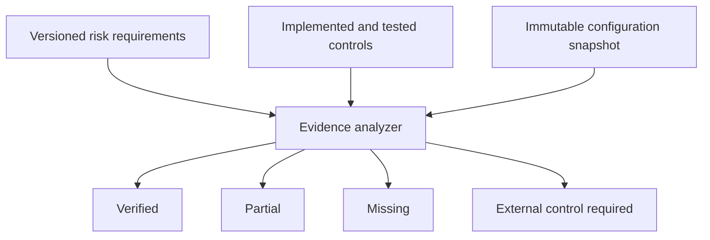

# Chapter 5 — Evidence-Based OWASP Control Gap Analysis

## The simple idea

Chapters 1–4 built security controls. Chapter 5 checks whether those controls really exist, are tested, sit in the correct layer, and support the risk claims we make.

An attachment point is only a place where a guard can stand. It is not proof that the guard is present or effective. This chapter therefore refuses to mark a risk covered merely because `PRE_INPUT`, `PRE_TOOL`, or `PRE_OUTPUT` exists.

## What the analyzer checks



Each evidence record contains:

- stable control ID;
- exact capability;
- control layer;
- implementation reference;
- test reference;
- attachment point when relevant;
- implemented and tested flags.

The analyzer counts evidence only when the capability, layer, attachment, implementation status, test status, and active configuration agree.

## Status meanings

| Status | Meaning |
|---|---|
| `verified` | Every requirement declared by this lab matrix has implemented and tested evidence |
| `partial` | Some requirements are verified, but important capabilities remain missing |
| `missing` | No required capability has verified evidence |
| `external_required` | The primary solution belongs outside runtime governance |

`verified` means verified against this lab’s declared requirements. It does not mean the risk is eliminated in every production environment.

## Honest Chapter 5 result

| Risk | Status | Why |
|---|---|---|
| T1 Memory Poisoning | External required | No persistent memory integrity or provenance system |
| T2 Tool Misuse | Verified lab controls | Allowlist, inventory/scope authorization, and ring routing are implemented and tested |
| T3 Privilege Compromise | Partial | Least privilege and binding exist; workload identity is synthetic |
| T4 Resource Overload | Partial | Worker timeout, bounds, and concurrency exist; no agent-wide budget or kill switch |
| T5 Cascading Hallucination | External required | Requires multi-agent review and independent verification |
| T6 Goal Manipulation | Partial | Tested keyword rules exist; semantic/adversarial detection does not |
| T7 Misaligned/Deceptive Behavior | External required | Requires framework evaluation and independent red teaming |
| T8 Untraceability | Partial | Correlation IDs exist; persistent tamper-evident audit does not |
| T9 Identity Spoofing | Partial | Identity binding and tool identity exist; cryptographic workload identity does not |
| T10 Human Approval Overload | External required | No approval risk tiers or queue throttling |

## Corrections to the book

1. A no-op evaluator is not control coverage.
2. Attachment presence alone cannot prove T4, T8, or T9.
3. T4 needs actual resource controls, not three checkpoint names.
4. T8 needs persistent protected evidence, not just correlation IDs.
5. Synthetic identity records are architecture, not cryptographic identity proof.
6. A frozen object containing a mutable pipeline is not a reliable audit snapshot.
7. Policy annotations are claims and must be validated against known capabilities.
8. Policy versions must not overwrite one another in the registry.
9. Reports use immutable tuples/arrays so findings cannot be edited after analysis.
10. The matrix is explicitly versioned and the audited configuration receives a SHA-256 fingerprint.

## Policy traceability

The Chapter 3 input policy includes an annotation connecting it to:

```text
T6 → preinput_goal_policy
```

The tool policy includes annotations connecting it to:

```text
T2 → tool_allowlist
T3 → least_privilege_tool_scopes
```

The validator rejects a runtime policy that claims a non-runtime risk such as T7. It also rejects a capability attached at the wrong checkpoint.

## Configuration fingerprint

The audit hashes an immutable representation of:

- selected policy version;
- exact rule names, priorities, conditions, actions, descriptions, and annotations;
- active attachment names and evaluator names;
- tool-to-ring assignments.

If the policy rules, policy version, attachments, or ring configuration change, the fingerprint changes. An audit report can therefore identify exactly which configuration it evaluated.

This is a configuration fingerprint, not a digital signature. Production still needs signed artifacts and protected audit storage.

## Run Python

From the repository root:

```bash
source .venv/bin/activate
PYTHONPATH=python pytest python -v
python python/control_audit.py
```

Use production-style strict mode to return a nonzero exit code for partial coverage:

```bash
python python/control_audit.py --fail-on-partial
echo $?
```

Expected strict exit code for the current lab is `2`, because five risks remain partial. That failure is intentional and honest.

## Run .NET

```bash
dotnet build dotnet/SecureCodingAgentBaseline/SecureCodingAgentBaseline.csproj
dotnet run --project dotnet/SecureCodingAgentBaseline/SecureCodingAgentBaseline.csproj
```

The application prints the Chapter 5 findings before any optional model call.

## False-confidence tests

Tests prove that:

- checkpoints without evidence produce no coverage;
- implemented but untested controls do not count;
- evidence at the wrong attachment point does not count;
- runtime rules cannot claim T7;
- real policy annotations validate;
- reports and findings cannot mutate;
- changing policy versions changes the fingerprint.
- declared source and test references resolve to real files and test functions.

## Interview explanation

> I built an evidence-based OWASP gap analyzer instead of counting policy hooks. Every coverage claim requires an implemented and tested capability at the correct layer and attachment point. The report distinguishes verified lab controls, partial coverage, missing controls, and risks that require data, framework, identity, infrastructure, or human-process remediation. It also fingerprints the audited configuration so the report cannot be confused with a different deployment configuration.

## Production limitations

- The matrix is a versioned lab interpretation of the book’s taxonomy, not a universal certification.
- Test references are source metadata; production CI should ingest signed test results and artifact attestations.
- Reports are immutable in memory but not yet written to append-only, tamper-evident storage.
- Control owners, due dates, accepted risk, and exception expiration are not yet modeled.
- A configuration hash detects difference; it does not prove who approved or signed the configuration.
