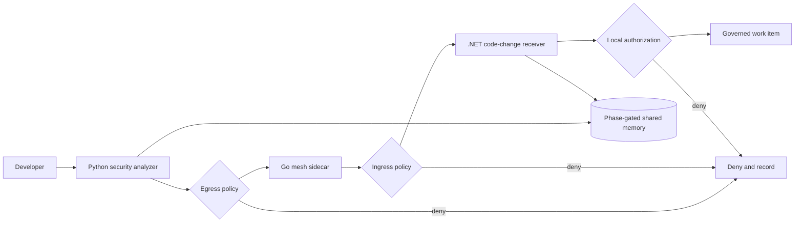

# Chapter 6 — Governed Cross-Framework Delegation

## The simple idea

The Python security-analysis agent may ask a .NET code-change agent to prepare a patch. The receiver must never trust a plain message saying “the Python agent sent me.” It requires a short-lived, one-use, signed permission slip.



No real repository, shell, Git, deployment, or patch-writing tool is added. The lab governs a proposed handoff and returns a work item only.

## Security controls

### Fully signed claims

The Ed25519 signature covers token, issuer, subject, audience, sorted scopes, workflow phase, correlation ID, repository ID, issue and expiration times, the one-use nonce, key ID, and delegation depth. Changing any authorization claim invalidates the signature. The key ID supports explicit rotation, while the depth limit prevents an unlimited chain of delegated authority.

### Narrow authority

The example token means:

```text
Receiver: dotnet-code-change-agent
Action: create_patch
Repository: payments-api
Phase: patch_creation
Lifetime: five minutes
Use: once
Signing key: explicit key ID
Delegation depth: at most one hop
```

Receiver, resource, scope, phase, lifetime, and nonce must all pass.

### Replay protection

The cache atomically consumes `(issuer, nonce)` after signature verification. A second use is denied. The Python and Go caches are process-local lab implementations; production needs a shared atomic TTL store across replicas.

### Governed memory

The segment is bound to one correlation ID. Segment rules control phases that may read and write; entry rules can be narrower. Values are serialized to immutable bytes instead of putting a mutable dictionary inside a frozen object.

### Default-deny mesh

Go uses `MeshDeny` as its zero value. Missing policies, unknown issuers or key IDs, altered signatures, wrong receivers, invalid lifetimes, replays, empty scopes, excessive delegation depth, denied phases, unknown repositories, and unapproved scopes deny. The HTTP boundary also rejects unknown fields, oversized bodies, and trailing JSON values.

### Strict lifecycle

```text
pending -> active -> completed
pending -> denied or expired
active  -> denied or expired
```

Completed, denied, and expired sessions are terminal.

## Files

| File | Purpose |
|---|---|
| `python/governance/delegation.py` | Tokens, signing, replay cache, memory, lifecycle, authorization |
| `python/test_delegation.py` | Permit path and attack tests |
| `python/delegation_demo.py` | Visible permit/deny output without an API key |
| `go-sidecar/mesh/sidecar.go` | HTTP ingress guard and default-deny mesh policy |
| `go-sidecar/mesh/sidecar_test.go` | Signature, replay, phase, scope, and missing-policy tests |
| `dotnet/SecureCodingAgentBaseline/Delegation.cs` | Receiving boundary, governed memory, fail-closed verifier contract |

## Run on macOS

```bash
source .venv/bin/activate
pip install -r requirements.txt
PYTHONPATH=python python -m pytest python/test_delegation.py -v
PYTHONPATH=python python python/delegation_demo.py
go test ./go-sidecar/... -v
dotnet build dotnet/SecureCodingAgentBaseline/SecureCodingAgentBaseline.csproj
dotnet run --project dotnet/SecureCodingAgentBaseline/SecureCodingAgentBaseline.csproj
```

Expected Python demo:

```text
PERMIT: create_patch for payments-api
DENY: delegation signature is invalid
DENY: delegation is bound to another repository
```

Without a configured .NET cryptographic verifier, the receiver visibly fails closed. Python and Go implement real Ed25519 verification. A production .NET adapter must verify the identical canonical claims; the lab does not substitute a fake signature check merely to print an allow result.

## Tests

The suite denies modified scopes, phases, repositories and correlation IDs; wrong audiences; expired and replayed tokens; missing mesh policies; unauthorized memory phases; another workflow’s memory; missing scope; wrong repository; and invalid lifecycle transitions.

## Production limits

- In-memory replay and handoff state do not work across replicas.
- In-process memory does not connect Python and .NET; use a governed external store.
- Network policy must prevent agents from bypassing the sidecar.
- Traffic needs authenticated encryption, preferably mTLS.
- Private keys belong in a managed key service, with issuer-and-key-ID trust records and a documented rotation/revocation process.
- Every allow, deny, transition, and tool action needs protected audit evidence.
- A sidecar is a checkpoint, not a complete identity platform or sandbox.
- Frozen dataclasses and records provide local safety, not transport integrity.

## Interview explanation

> I extended the single-agent controls into a cross-framework delegation design. A Python analyzer issues a short-lived Ed25519-signed token bound to the .NET receiver, an exact scope, workflow phase, repository, correlation ID, key ID, delegation depth, and one-use nonce. A Go sidecar enforces default-deny mesh policy, and the receiver authorizes locally again before any capability is used. Shared data is correlation- and phase-gated, while a strict lifecycle prevents stale handoffs from resuming. I also corrected the sample by signing every authorization claim and documenting in-memory stores as lab controls rather than production infrastructure.

## Memory sentence

**When work moves to another agent, identity, limited permission, policy, and audit context must move safely with it.**
