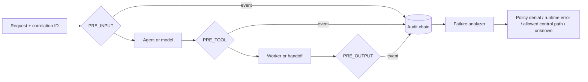

# Chapter 7 — Audit Evidence, Correlation, and Security Tests

## The simple idea

Chapters 1–6 added guards. Chapter 7 creates evidence proving which guard ran, which rule decided, and whether the request was allowed, denied, or stopped by an error.



## What the lab implements

- one correlation ID preserved across sandbox and framework handoff contexts;
- a trace path that shows technical boundary transitions;
- one deeply immutable structured record per evaluator result;
- distinct `ALLOW`, `DENY`, and `ERROR` audit decisions;
- policy version, policy name, identity, boundary, reason, and duration fields;
- a thread-safe append-only in-memory store;
- a SHA-256 record chain that detects local modification;
- timeline reconstruction by correlation ID;
- failure classification;
- security tests proving both enforcement and evidence;
- fail-closed behavior when the audit observer cannot record an allow decision.
- audit-observer wiring on the normal Python and .NET agent execution paths, not only diagnostics.

## Evidence flow

`EvaluationPipeline` emits a `PolicyEvaluationEvent` after each evaluator. `PipelineAuditObserver` converts it into an `AuditEvent`. `InMemoryAuditStore` assigns sequence, timestamp, previous hash, and record hash. `FailureAnalyzer` reconstructs the timeline.

The agent is unchanged. Auditing is an observer of governance—not agent business logic.

## Files

| File | Purpose |
|---|---|
| `python/governance/audit.py` | Immutable evidence, hash chain, observer, analyzer |
| `python/test_audit.py` | Eleven security/evidence tests |
| `python/audit_demo.py` | Visible denial and reconstructed timeline |
| `python/governance/pipeline.py` | Emits evaluator events without changing policy rules |
| `python/governance/models.py` | Correlation and trace propagation helpers |
| `dotnet/SecureCodingAgentBaseline/Audit.cs` | Matching .NET audit store, observer, analyzer, diagnostic |

## Run on macOS

```bash
source .venv/bin/activate
PYTHONPATH=python python -m pytest python/test_audit.py -v
PYTHONPATH=python python python/audit_demo.py
PYTHONPATH=python python -m pytest python -v
dotnet build dotnet/SecureCodingAgentBaseline/SecureCodingAgentBaseline.csproj
dotnet run --project dotnet/SecureCodingAgentBaseline/SecureCodingAgentBaseline.csproj
```

Expected demo facts:

```text
Decision: DENY
Agent calls: 0
Classification: policy_denial
Integrity chain valid: True
```

## What the tests prove

- malicious input produces `PRE_INPUT` denial evidence and zero agent calls;
- an unauthorized tool produces `PRE_TOOL` denial evidence;
- secret output produces `PRE_OUTPUT` denial evidence;
- evaluator exceptions create `ERROR` evidence while execution denies;
- audit observer failure stops an otherwise allowed request;
- correlation survives sandbox and .NET handoff boundaries;
- record and metadata structures cannot mutate normally;
- modification breaks the local hash chain;
- missing evidence is classified as `unknown`, not success.
- the normal agent runner emits audit evidence outside the Chapter 7 diagnostic;
- free-form evidence is bounded and common credential formats are redacted.

## Corrections to the book sample

1. A frozen record containing a dictionary is not deeply immutable; metadata uses immutable tuples/maps.
2. An in-memory list is not production audit storage.
3. A local hash chain detects modification but is not a digital signature or external proof.
4. “All controls allowed” does not prove the model or tool succeeded; separate operational events are required.
5. Audit evidence records rule/policy name and version, not only the attachment point.
6. Tests verify that a denied input never reached the agent, not merely that the final text looked like a refusal.
7. Raw prompts, source, credentials, and delegation tokens are not written into audit metadata.

## Honest OWASP T8 status

Chapter 7 adds implemented and tested structured policy auditing, correlation propagation, and a local integrity chain. T8 remains **partial**, because production still requires durable centralized storage, access control, retention, independently protected or signed evidence, clock assurance, and cross-service delivery guarantees.

## Production requirements

- export asynchronously to a durable append-only stream or SIEM;
- buffer safely when the remote store is unavailable;
- authenticate producers and encrypt transport;
- prevent log injection and enforce a stable schema;
- redact secrets and minimize personal/client data;
- define retention, legal hold, access review, and deletion policies;
- alert on audit gaps, sequence gaps, error spikes, and delivery lag;
- use OpenTelemetry-compatible trace/span IDs;
- sign batches or anchor hashes outside the application trust boundary;
- ensure audit failure behavior matches the risk of each action.

## Interview explanation

> I instrumented each governance evaluator rather than checking only the final agent response. Every allow, deny, timeout, and exception produces an immutable structured event containing correlation and trace IDs, principal and agent identity, policy version, rule name, boundary, reason, and duration. Security tests prove that malicious input is denied at PRE_INPUT, the agent is never called, and the evidence exists. A failure analyzer reconstructs the timeline and separates intentional policy denials from runtime failures. The lab uses a local hash chain for integrity testing, while accurately retaining T8 as partial until evidence is stored in protected durable infrastructure.

## Memory sentence

**Record every guard, link every step, test the evidence, and never confuse a denial with a system failure.**
