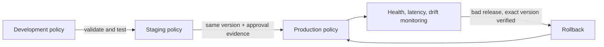

# Chapter 8 — Production Deployment and Continuous Policy Operations

Chapter 8 changes the question from **“Does the policy work on my laptop?”** to
**“Can we operate it safely every day?”**

## The simple picture

Think of policy as the rulebook used by a security guard. Production operations
must make sure that:

1. the guard has the correct approved rulebook;
2. a new rulebook is tested before it reaches the front door;
3. a bad release can be rolled back safely;
4. every change leaves evidence;
5. broken security components make the service unready; and
6. policy checks do not consume the agent's whole latency budget.



## What the lab builds

### Policy channels and promotion

`OperationalPolicyRegistry` stores the active version for `DEV`, `STAGING`,
and `PROD`. `PolicyPromotionPipeline` only permits:

- development → staging;
- staging → production; and
- the exact version tested in staging to enter production.

Direct development → production promotion is rejected.

### Compare-and-swap activation

Every activation states which version it expects to replace. If another operator
or incident has already changed the active version, the operation stops. This
prevents an old automation job from overwriting newer state.

### History and rollback

The Python lab writes activation history to a permission-restricted JSON Lines
file and calls `fsync`. Rollback finds the previous version and restores it only
when the reported bad version is still active. Incident keys are deduplicated.

This is restart-persistent lab storage, not a distributed production database.
Production needs transactional writes, replication, access control, encryption,
retention, backups, and independently protected audit evidence.

### Fail-open and fail-closed

- `PRE_INPUT` must fail closed.
- `PRE_TOOL` must fail closed.
- `PRE_OUTPUT` also fails closed by default.
- A low-risk optional output check may fail open only through explicit config.

Fail closed means a broken control stops the request. Fail open means the request
continues. A security-critical authorization check must never quietly fail open.

### SLO and latency budget

`GovernanceSlo` assigns a maximum time to each boundary.
`LatencyBudgetEnforcer` checks the elapsed evaluation time and applies that
boundary's fail mode. This is a local teaching implementation; production should
also cancel work at the deadline and measure percentiles such as p95 and p99.

### Drift detection

`PolicyDriftDetector` compares the running policy version and attachment points
with an externally approved baseline. It detects unexpected changes, but it does
not decide that the current state is approved merely because it is running.

### Readiness

`GovernanceHealthProbe` returns structured health results and never leaks the
original exception message. The Go mesh sidecar exposes `/readyz` and returns
HTTP 503 when identity, issuer keys, replay protection, or mesh policies are
missing. Readiness answers “may this instance receive traffic?” Liveness should
only answer “is the process alive?”

### Rust lifecycle

`ProductionHotPathHandle` validates startup state, reports readiness, closes
idempotently, denies evaluations after close, and runs cleanup from `Drop`.
It models lifecycle safety. It does not pretend to unload a real operating-system
dynamic-library handle.

## Run the lab on macOS

From the repository root:

```bash
source .venv/bin/activate
PYTHONPATH=python pytest python/test_operations.py -v
PYTHONPATH=python python python/operations_demo.py

(cd go-sidecar && go test ./...)
cargo test --manifest-path hot_path_evaluator/Cargo.toml
dotnet run --project dotnet/SecureCodingAgentBaseline/SecureCodingAgentBaseline.csproj
```

Expected Python demo highlights:

```text
PROD active: 1.0.0
Drift detected: False
Ready: True
Rolled back to: 1.0.0
Audit chain valid: True
```

## What Chapter 8 does not claim

This repository is not production-ready. It has no distributed policy control
plane, signed policy bundles, Kubernetes manifests, managed key service,
transactional outbox, central durable audit store, global agent budget, or kill
switch. Chapter 8 demonstrates the contracts and failure behavior that those
production services must preserve.

## Interview explanation

“I treated policies like deployable security software. A version must pass from
development to staging before the exact version reaches production. Activation
uses compare-and-swap, every attempted change is recorded, stale or duplicate
rollback signals are rejected, critical boundaries fail closed, and readiness,
latency, and drift are continuously checked.”
